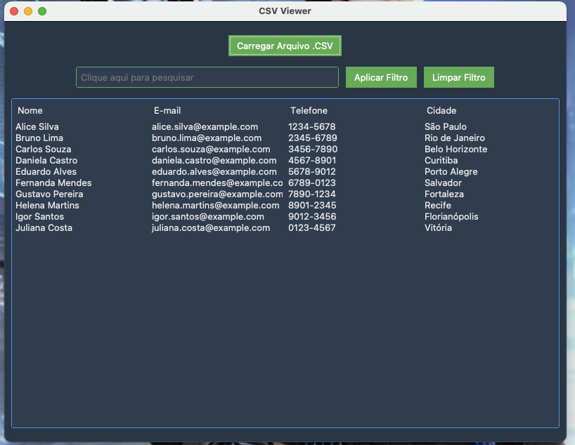
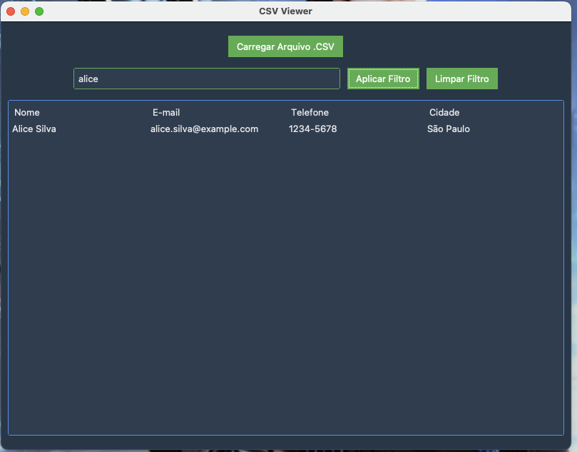

# CSV Explorer

O CSV-Explorer  App é uma aplicação simples em Tkinter que permite aos usuários carregar, visualizar e filtrar arquivos CSV. A interface gráfica foi construída utilizando o ttkbootstrap para um visual moderno e personalizável.

  

  

  

## Funcionalidades

- Carregar arquivos CSV e exibir os dados em uma tabela.
- Filtrar os dados exibidos com base em uma palavra-chave (case insensitive).
- Limpar filtros e exibir todos os dados novamente.
- Placeholder no campo de busca para uma melhor experiência do usuário.
- Janela centralizada ao abrir o aplicativo.

## Tecnologias Utilizadas

- Python 3.x
- tkinter
- ttkbootstrap
- Pandas